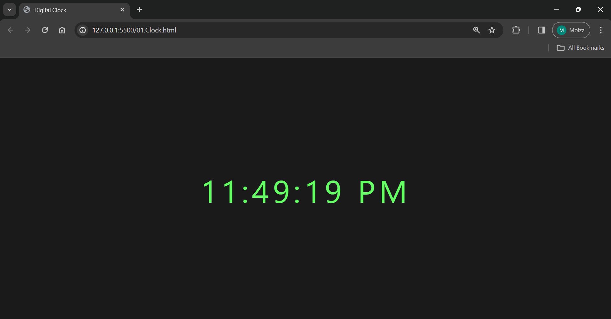

# JavaScript Projects

This repository showcases three projects built using HTML, CSS, and JavaScript: a Digital Clock, a Calculator, and a Todo List application.

## 1. Digital Clock



A simple digital clock that displays the current time in both 12-hour and 24-hour formats.

### Features:
- Shows the current time with seconds ticking.
- Automatically adjusts to the user's local time zone.
- Displays time in both 12-hour and 24-hour formats.

### Installation:
1. Clone the repository:
    ```bash
    git clone https://github.com/your-username/digital-clock.git
    ```
2. Open `01.Clock.html` in your web browser.

### Usage:
Simply open the `01.Clock.html` file in your web browser to view the digital clock.

### Forking and Contributing:
1. Fork the repository.
2. Make necessary changes and commit them.
3. Submit a pull request.

## 2. Calculator


A basic calculator that performs simple arithmetic operations.

### Features:
- Addition, subtraction, multiplication, and division operations.
- Clear button to reset the input field.

### Installation:
1. Clone the repository:
    ```bash
    git clone https://github.com/your-username/calculator.git
    ```
2. Open `02.Calculator.html` in your web browser.

### Usage:
Enter numbers and operators using the on-screen buttons and click '=' to view the result.

### Forking and Contributing:
1. Fork the repository.
2. Make required enhancements or bug fixes.
3. Create a pull request with a clear description of changes.

## 3. Todo List


A simple todo list application to keep track of tasks.

### Features:
- Add new tasks.
- Mark tasks as completed.
- Remove tasks.

### Installation:
1. Clone the repository:
    ```bash
    git clone https://github.com/your-username/todo-list.git
    ```
2. Open `03.ToDo-list.html` in your web browser.

### Usage:
- Enter a task in the input field and press 'Add' to add it to the list.
- Click on a task to mark it as completed.
- Hover over a task and click the 'X' button to delete it.

### Forking and Contributing:
1. Fork the repository to your account.
2. Implement desired features or fixes.
3. Submit a pull request to the original repository.